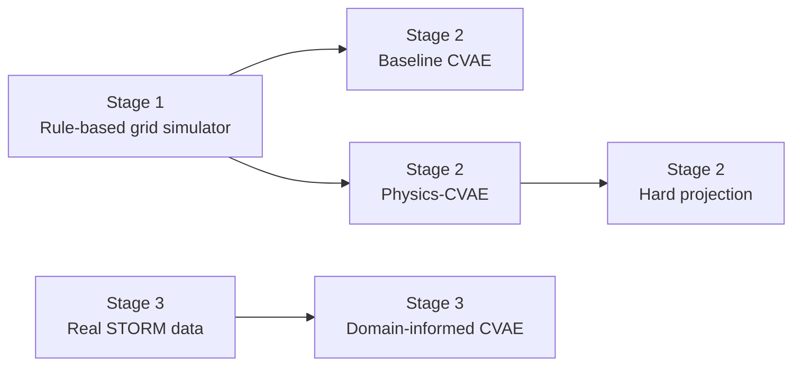

# Physics-Informed Generative Modeling for Synthetic Energy Data

A three-stage research prototype for studying how synthetic energy time series can preserve statistical and temporal structure while respecting physical or domain constraints.

The project progresses from a transparent rule-based distribution-grid simulator, to a physics-aware conditional variational autoencoder (CVAE), and finally to a domain-informed CVAE trained on real STORM substation data.

## Research question

**How can generative models produce realistic energy time series while preserving temporal behavior and improving physical or domain consistency?**

The project studies the trade-off between:

- statistical fidelity,
- temporal fidelity,
- physical consistency,
- domain plausibility.

## Project overview



### Stage 1 — STORM-like physics simulator

A transparent synthetic-data generator creates 15-minute electrical time series for residential, commercial, and industrial consumers.

The simulator includes:

- configurable consumer characteristics,
- time-of-day and weekend behavior,
- weather effects,
- PV generation,
- EV charging,
- a radial distribution network,
- line capacities and distances,
- approximate three-phase current,
- resistive line losses,
- approximate voltage drop,
- anomalies, switching-like events, and missing measurements,
- STORM-like `S_original`, `BU_original`, and label outputs.

The grid model is intentionally simplified and should **not** be interpreted as a full AC power-flow solver.

### Stage 2 — Physics-aware synthetic generation

Stage 2 trains generative models on the synthetic grid data.

Models:

1. **CVAE** — conditional variational autoencoder baseline.
2. **Physics-CVAE (soft)** — CVAE with differentiable physical penalties.
3. **Physics-CVAE (hard projection)** — generated samples are projected to satisfy selected physical identities exactly.

Generated variables:

- `consumption_kw`
- `pv_generation_kw`
- `net_load_kw`

The soft physical loss penalizes:

- violation of `net_load = consumption - pv_generation`,
- negative consumption,
- negative PV generation,
- line overload,
- voltage-limit violations.

The hard projection clips consumption and PV to non-negative values and recomputes:

```text
net_load = consumption - pv_generation
```

### Stage 3 — Real STORM data

Stage 3 trains directly on real STORM substation measurements using:

- `S_original`
- `BU_original`

The baseline CVAE is compared with a **domain-informed CVAE**.

Because the released STORM X/y data do not include the full network topology, line parameters, voltage states, and capacity information required for power-flow constraints, Stage 3 uses **domain constraints rather than claiming full physics-informed power-flow modeling**.

The domain-informed loss includes:

- non-negative `S_original` and `BU_original`,
- matching the mean and standard deviation of `S_original - BU_original`,
- penalties on unrealistic temporal ramps.

## Repository structure

```text
storm_physics_genai/
│
├── README.md
├── requirements.txt
├── .gitignore
│
├── stage1_simulator/
│   ├── energy_simulator.py
│   └── README.md
│
├── stage2_physics_cvae/
│   ├── physics_cvae.py
│   └── README.md
│
├── stage3_real_storm/
│   ├── physics_cvae_storm.py
│   └── README.md
│
├── notebooks/
│   ├── stage1_simulator_demo.ipynb
│   └── stage2_physics_cvae_demo.ipynb
│
├── docs/
│   └── figures/
│
└── tests/
    └── test_smoke.py
```

## Installation

```bash
python -m venv .venv
```

Windows:

```bash
.venv\Scripts\activate
```

macOS/Linux:

```bash
source .venv/bin/activate
```

Install dependencies:

```bash
python -m pip install --upgrade pip
pip install -r requirements.txt
```

## Reproducing Stage 1

From the repository root:

```bash
python stage1_simulator/energy_simulator.py --days 30 --consumers 18 --output stage1_results
```

For a larger dataset suitable for Stage 2:

```bash
python stage1_simulator/energy_simulator.py --days 180 --consumers 18 --output stage2_data
```

## Reproducing Stage 2

Final configuration used for the physics-aware comparison:

```bash
python stage2_physics_cvae/physics_cvae.py \
    --data-dir stage2_data \
    --output stage2_final \
    --epochs 100 \
    --physics-weight 0.5 \
    --seed 42
```

On Windows PowerShell, the same command can be written on one line:

```powershell
python stage2_physics_cvae\physics_cvae.py --data-dir stage2_data --output stage2_final --epochs 100 --physics-weight 0.5 --seed 42
```

### Stage 2 result summary

The physics-weight sweep showed a clear fidelity–consistency trade-off. A weight of **0.5** preserved temporal behavior while substantially improving power-balance consistency.

| Model | Power-balance RMSE (kW) | Mean-profile RMSE (kW) | Daily-energy gap (%) | Lag-1 autocorrelation |
|---|---:|---:|---:|---:|
| Real simulator data | ~0 | — | — | 0.8915 |
| CVAE | 1.1970 | 4.2697 | 3.2346 | 0.9255 |
| Physics-CVAE, soft | 0.4349 | 5.6951 | 2.1754 | 0.8916 |
| Physics-CVAE, hard | 0.0000 | 5.6981 | 2.0975 | 0.8915 |

The soft Physics-CVAE reduced power-balance RMSE by about **64%** relative to the baseline while preserving the real lag-1 temporal correlation almost exactly.

The hard projection enforces non-negativity and exact power balance, but should be interpreted as a post-processing constraint rather than a learned guarantee.

## Reproducing Stage 3

Place the STORM training data in:

```text
storm_data/
└── Train/
    ├── X/
    └── y/
```

Then run:

```bash
python stage3_real_storm/physics_cvae_storm.py \
    --train-dir storm_data/Train \
    --output stage3_final \
    --epochs 120 \
    --domain-weight 0.1 \
    --seed 42
```

Windows PowerShell:

```powershell
python stage3_real_storm\physics_cvae_storm.py --train-dir storm_data\Train --output stage3_final --epochs 120 --domain-weight 0.1 --seed 42
```

### Stage 3 result summary

The final Stage 3 experiment used:

```text
latent_dim = 16
hidden_dim = 192
batch_size = 32
epochs = 120
learning_rate = 0.001
beta_kl = 0.001
domain_weight = 0.1
seed = 42
```

| Metric | CVAE | Domain-informed CVAE |
|---|---:|---:|
| `S_original` mean-profile RMSE | 3409.1 | 4908.5 |
| `BU_original` mean-profile RMSE | 3533.3 | 6479.6 |
| Negative `S_original` fraction | 0.009745 | 0.000330 |
| Negative `BU_original` fraction | 0.013865 | 0.000499 |
| Residual std gap | 965.1 | 400.4 |
| Lag-1 autocorrelation | 0.9813 | 0.9719 |
| Real lag-1 autocorrelation | 0.9737 | 0.9737 |

The baseline CVAE provides stronger mean-profile fidelity, while the domain-informed model substantially improves non-negativity and residual-statistic consistency.

Most importantly, at `domain_weight = 0.1`, temporal structure remains close to the real STORM data:

```text
real lag-1 autocorrelation       = 0.9737
domain-informed CVAE             = 0.9719
```

This illustrates the central theme of the project: **stronger constraints can improve validity, but excessive regularization can reduce statistical fidelity.**

## Suggested figures for the repository

Place the final figures in `docs/figures/` and include:

1. Stage 1 radial-network visualization.
2. Stage 1 STORM-like synthetic substation time series.
3. Stage 2 mean daily profile comparison.
4. Stage 2 physical-consistency comparison.
5. Stage 3 real-STORM vs generated mean daily profile.

For example:

```markdown


```

## Key findings

- A transparent rule-based simulator can generate STORM-like measurements while retaining interpretable grid and consumer variables.
- A standard CVAE can reproduce temporal structure well but does not guarantee physical validity.
- Soft physical regularization improves physical consistency but introduces a tunable trade-off with statistical fidelity.
- Hard projection can enforce selected identities exactly.
- On real STORM data, domain-informed regularization strongly reduces invalid negative outputs and improves residual statistics.
- Lower domain regularization (`0.1`) preserves temporal autocorrelation much better than stronger regularization.

## Limitations

This repository is a research prototype.

Important limitations:

- Stage 1 uses an approximate radial-grid model, not full AC power flow.
- Stage 2 learns from synthetic simulator data, so results depend on simulator assumptions.
- Voltage violations are rare in the current synthetic configuration because the simulated network is electrically stiff.
- Stage 3 cannot enforce full network physics because the public STORM X/y data used here do not contain the required topology, voltage, and line-capacity information.
- The current Stage 3 experiment uses a temporal holdout within the STORM training data. Integrating the official Validation and Test sets as separate external evaluations is a natural next step.
- Differential privacy is not implemented in this prototype.
- More expressive temporal generative architectures such as sequence VAEs, diffusion models, flow matching, and graph-based generative models are future directions.

## Future work

Potential extensions include:

- AC or validated distribution power-flow models,
- graph neural networks for network-aware generation,
- temporal convolutional or Transformer-based encoders/decoders,
- diffusion and flow-matching models,
- explicit differential privacy,
- train-synthetic-test-real downstream evaluation,
- uncertainty calibration,
- testing on official STORM Validation and Test splits,
- privacy–utility–physics trade-off analysis.

## Purpose

This project was developed as an exploratory research prototype at the intersection of:

- generative AI,
- energy time series,
- physics-informed machine learning,
- probabilistic modeling,
- synthetic data,
- distribution-grid analysis.

The emphasis is on transparent experimentation and on understanding the trade-off between **realism** and **constraint satisfaction**, rather than claiming a production-ready grid simulator or a complete power-system generative model.
